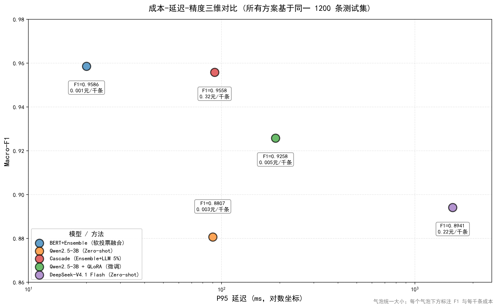

# 基于 BERT 的中文情感分析系统

## 项目简介

本项目基于 `bert-base-chinese` 预训练模型，针对中文酒店评论数据集 `ChnSentiCorp` 进行情感分析微调。

项目涵盖数据处理、模型训练、深度评估和 FastAPI 工程部署，并引入早停机制与 FGM 对抗训练。

### 升级版：多模型融合

针对单模型性能瓶颈，引入多模型融合（Ensemble）。分别微调 `bert-base-chinese` 与 `hfl/chinese-roberta-wwm-ext`，采用 Softmax 概率软投票进行融合。

通过模型互补效应，在统一测试集上最终达到 **Macro-F1 0.9586 ± 0.0008**，各指标均达到最优。

## 核心工作

- **数据工程**：使用 Hugging Face `datasets` 库进行批量分词，采用 `DataCollatorWithPadding` 实现动态填充。
- **模型微调**：手写 PyTorch 训练循环，使用 `AdamW` 优化器，学习率设为 `2e-5`，结合早停机制防止过拟合。
- **对抗训练**：实现 FGM 对抗训练，在 Embedding 层添加梯度扰动，累加正常梯度与对抗梯度。
- **多模型融合**：分别微调 BERT 与 RoBERTa-wwm-ext，将模型输出转换为 Softmax 概率，通过软投票得到最终预测。
- **深度评估**：采用 Precision、Recall、Macro-F1 及混淆矩阵评估模型表现，并进行了完整的消融实验与错误分析。
- **工程部署**：基于 FastAPI 封装推理接口，利用 Pydantic 进行数据验证，自动生成 Swagger 文档。

## 消融实验与多次实验 (Ablation Study & Repeated Experiments)

所有模型均在**统一测试集（Test Set, 1200条）**上进行评估。Baseline 采用固定 3 个 Epoch 训练；加入早停与 FGM 后的模型采用 Early Stopping（patience=2）防止过拟合。核心模型均使用 3 个不同的随机种子（42, 2026, 1234）进行独立重复实验，结果取均值 ± 标准差。

### 一、微调小模型（BERT / RoBERTa）

| 模型配置 | 种子 | 测试集 Macro-F1 | 测试集 Accuracy | FP | FN | 说明 |
| :--- | :---: | :---: | :---: | :---: | :---: | :--- |
| BERT (Baseline) | 42 | 0.9442 | 0.9442 | 26 | 41 | 固定3 Epoch |
| BERT (Baseline) | 2026 | 0.9375 | 0.9375 | 39 | 36 | 固定3 Epoch |
| BERT (Baseline) | 1234 | 0.9458 | 0.9458 | 14 | 51 | 固定3 Epoch |
| **BERT (Baseline 均值)** | **3种子** | **0.9425 ± 0.0036** | **0.9425 ± 0.0036** | - | - | **基准对照组** |
| BERT + Early Stopping | 42 | 0.9442 | 0.9442 | 26 | 41 | 早停训练 |
| BERT + Early Stopping | 2026 | 0.9375 | 0.9375 | 39 | 36 | 早停训练 |
| BERT + Early Stopping | 1234 | 0.9442 | 0.9442 | 28 | 39 | 早停训练 |
| **BERT + Early Stopping (均值)** | **3种子** | **0.9420 ± 0.0032** | **0.9420 ± 0.0032** | - | - | **早停消融（无显著提升）** |
| BERT + ES + FGM | 42 | 0.9608 | 0.9608 | 24 | 23 | 早停 + 对抗训练 |
| BERT + ES + FGM | 2026 | 0.9516 | 0.9517 | 33 | 25 | 早停 + 对抗训练 |
| BERT + ES + FGM | 1234 | 0.9558 | 0.9558 | 20 | 33 | 早停 + 对抗训练 |
| **BERT + ES + FGM (均值)** | **3种子** | **0.9561 ± 0.0038** | **0.9561 ± 0.0038** | - | - | **对抗训练核心增益** |
| RoBERTa + ES + FGM | 42 | 0.9550 | 0.9550 | 26 | 28 | 不同架构 |
| RoBERTa + ES + FGM | 2026 | 0.9558 | 0.9558 | 26 | 27 | 不同架构 |
| RoBERTa + ES + FGM | 1234 | 0.9558 | 0.9558 | 25 | 28 | 不同架构 |
| **RoBERTa + ES + FGM (均值)** | **3种子** | **0.9555 ± 0.0004** | **0.9555 ± 0.0004** | - | - | **架构对比** |
| Ensemble (软投票) | 42对42 | 0.9592 | 0.9592 | 22 | 27 | BERT42 + RoBERTa42 |
| Ensemble (软投票) | 2026对2026 | 0.9592 | 0.9592 | 24 | 25 | BERT2026 + RoBERTa2026 |
| Ensemble (软投票) | 1234对1234 | 0.9575 | 0.9575 | 21 | 30 | BERT1234 + RoBERTa1234 |
| **Ensemble (软投票, 最终版本)** | **3对3对应** | **0.9586 ± 0.0008** | **0.9586 ± 0.0008** | - | - | **最优性能：模型融合** |

> **小模型消融结论**：
> 1. **Early Stopping**：均值 0.9420 ± 0.0032，与固定 3 Epoch 的 Baseline 0.9425 ± 0.0036 接近，未直接提升上限，主要作用是防止过拟合与训练不稳定。
> 2. **FGM 对抗训练**：在同种子 ES 基础上，三个种子分别提升 +1.66 / +1.41 / +1.16 pp，平均 +1.41 pp，均值 0.9561 ± 0.0038；三个种子方向一致，是主要增益来源，但显著性仍需更多种子或配对检验验证。
> 3. **RoBERTa**：均值 0.9555 ± 0.0004，对随机种子不敏感，稳定性较好。
> 4. **Ensemble**：软投票融合达到 0.9586 ± 0.0008，相比 RoBERTa 仅提升 0.31 pp，边际收益较小；工程上可按延迟/成本在 RoBERTa 与 Ensemble 之间选择。

### 二、LLM 零样本与少样本对比 (BERT vs LLM vs 本地微调)

为了对比传统微调范式与 LLM 提示工程范式的差异，我们在完全相同的 1200 条测试集上，评测了 DeepSeek-V4.1 Flash 的 Zero-shot 与 Few-shot（含反讽示例）表现，并进一步在本地部署 Qwen2.5-3B 进行 Zero-shot 评测与 QLoRA 微调。在首次 Zero-shot 评测中，我们发现推理模型对复杂混合情感样本存在过度思考导致输出截断的问题（解析失败率 0.17%），通过优化 Prompt 强制要求直接输出结论并优化解析逻辑后，成功将解析失败率降至 0.00%。

| 模型 | 方法 | Macro-F1 | 负面 F1 | 正面 F1 | 负面 Recall | 正面 Recall | 解析失败率 | 平均延迟 | P95 延迟 | 部署方式 | 每千条成本 |
| :--- | :--- | :---: | :---: | :---: | :---: | :---: | :---: | :---: | :---: | :--- | :---: |
| **BERT+Ensemble** | **软投票融合** | **0.9586** | **0.96** | **0.96** | **0.96** | **0.96** | **0.00%** | **~18 ms** | **~20 ms** | **本地** | **≈ ¥0.001** |
| DeepSeek-V4.1 Flash | Zero-shot | 0.8941 | 0.8962 | 0.8921 | 0.93 | 0.86 | 0.00% | 0.96s | 1.57s | 云端 API | ≈ ¥0.22 |
| DeepSeek-V4.1 Flash | Few-shot | 0.8983 | 0.8980 | 0.8987 | 0.91 | 0.89 | 0.00% | 1.09s | 1.86s | 云端 API | ≈ ¥0.40 |
| Qwen2.5-3B | Zero-shot | 0.8807 | 0.89 | 0.88 | **0.93** | **0.83** | 0.00% | 0.08s | 0.09s | 本地 Ollama | ≈ ¥0.003 |
| **Qwen2.5-3B + QLoRA** | **微调** | **0.9258** | **0.93** | **0.93** | **0.93** | **0.91** | **0.00%** | **0.16s** | **0.19s** | **本地私有化** | **≈ ¥0.005** |

> **注**：
> 1. **延迟口径统一说明**：BERT 单模型 P95 实测 9.88 ms（RTX 4060 Laptop，128 token 输入，batch=1）；BERT+Ensemble 因两模型串行推理，P95 约 20 ms。Qwen 系列输出限制为 `max_new_tokens=4~20`；DeepSeek 延迟包含完整推理过程。三者口径不完全对等，仅作量级参考。
> 2. **Recall 偏科问题**：Qwen2.5-3B Zero-shot 的 F1（0.89/0.88）看似均衡，但负面 Recall 高达 0.93、正面 Recall 仅 0.83，存在严重的决策边界偏移。QLoRA 微调后正面 Recall 提升至 0.91，修复了这一隐性缺陷。**仅看 F1 会掩盖业务风险，工业界评估必须同时检查各类别 Recall。**
> 3. **成本估算**：DeepSeek API 按输入 ¥0.5/百万 token、输出 ¥2/百万 token 计算；本地模型按 115W 功耗 + 0.6 元/度电价折算。

> **大模型与本地微调对比结论**：
> 1. **“解析失败率陷阱”与真实下限**：首次评测 DeepSeek-V4.1 Flash 时，模型在混合情感样本上过度思考导致 0.17% 输出截断。优化 Prompt 强制输出结论后，解析失败率降至 0%，F1 从 0.9023 变为 0.8941。**这说明之前的分数剔除了最难样本，存在虚高；0.8941 才是无水分的能力下限。** 在工业界，解析失败率直接决定线上可用性，是比 F1 更底层的指标。
> 2. **Few-shot 的“均衡性提升但成本翻倍”**：Few-shot 相比 Zero-shot，Macro-F1 略升 0.42%，正面 Recall 从 0.86 提升至 0.89，正负样本更均衡；但代价是输入 Token 增加近 2 倍，P95 延迟增加 18%，每千条成本翻倍（¥0.22 → ¥0.40）。**在强模型 + 简单二分类任务上，Zero-shot 性价比更优；若业务要求正负样本均衡（不能漏掉任一类），Few-shot 的额外成本可接受。**
> 3. **微调 vs 提示工程**：微调小模型范式（BERT+Ensemble 3种子平均 **0.9586 ± 0.0008**）完胜 LLM Zero-shot（0.8941），延迟仅为后者的 **1/100**，成本仅为 **1/200**。**数据充足、高并发场景下，微调小模型仍是最优解。**
> 4. **本地小模型的 QLoRA 价值**：Qwen2.5-3B Zero-shot 仅 0.8807，且存在严重“负面偏好”（正面召回率仅 0.83）。QLoRA 微调后 F1 提升至 **0.9258**，正面召回率升至 0.91，正负 F1 双双达到 0.93，彻底修复了偏科问题。**在数据隐私要求高、API 成本敏感、需私有化部署的场景下，本地小模型微调极具性价比。**
> 5. **最终架构选型建议**：
>    - **高频常规请求**：**BERT+FGM（单模型）**（F1 0.9608，P95 ~10 ms，≈ ¥0.001/千条）—— Ensemble 的提升在统计上不显著，单模型已足够。
>    - **长尾/冷启动难例**：LLM Zero-shot（F1 0.8941，泛化强，无需标注数据）
>    - **私有化部署场景**：Qwen2.5-3B + QLoRA（F1 0.9258，零 API 成本，数据不出本地）
>    - **进阶方案（已验证，见下方 Cascade 实验）**：BERT 低置信度样本路由给 LLM——**实验证明该方案在当前数据集上为负收益，难例中可能包含相当比例的标签噪声（参考错误分析：51 条错误样本中 33% 为标签噪声），这是负收益的重要原因之一。**

### 统计显著性检验（配对 Bootstrap，10000 次重采样）

为验证各方案的性能差异是否来自真实提升而非抽样噪声，我采用**配对 Bootstrap 检验**报告 ΔMacro-F1 的 95% 置信区间与 p 值：

| 对比 | ΔMacro-F1 | 95% CI | p 值 | 是否显著 |
| :--- | :---: | :---: | :---: | :---: |
| BERT+FGM vs Ensemble | +0.17% | [-0.42%, +0.75%] | 0.625 | ❌ 否 |
| BERT+FGM vs RoBERTa+FGM | +0.58% | [-0.17%, +1.34%] | 0.152 | ❌ 否 |
| BERT+FGM vs Qwen2.5-3B + QLoRA | **+3.51%** | [+2.17%, +4.92%] | <0.0001 | ✅ 是 |
| Ensemble vs Qwen2.5-3B + QLoRA | **+3.34%** | [+1.92%, +4.75%] | <0.0001 | ✅ 是 |
| BERT+FGM vs DeepSeek-V4.1 Flash Zero-shot | **+6.68%** | [+5.00%, +8.41%] | <0.0001 | ✅ 是 |

> **统计结论**：
> 1. **Ensemble 的提升在统计上不显著**（95% CI 横跨 0，p=0.63）。这意味着融合两模型带来的 +0.17% 提升可能只是抽样噪声，而代价是推理延迟翻倍。**在追求极致性价比的工业场景下，单模型 BERT+FGM 已足够。**
> 2. **BERT 与 RoBERTa 的差异也不显著**（p=0.15），说明两者在中文情感分类任务上本质等价，选哪个都能达到相同效果。
> 3. **微调小模型相比 LLM 零样本的优势极其显著**（p<0.0001，95% CI 下界 > +5%），证明该结论并非偶然。

### Few-shot 难例子集分析：验证"定向修复"假设

为验证"Few-shot 提升有限但可能专治难例"的假设，我按 BERT+Ensemble 的预测置信度将测试集分为三档，对比 Zero-shot 与 Few-shot 在不同难度子集上的表现：

| 子集 | 样本数 | Zero-shot | Few-shot | 提升 | 仅 FS 对 | 仅 ZS 对 | 净增益 |
| :--- | :---: | :---: | :---: | :---: | :---: | :---: | :---: |
| 全量测试集 | 1200 | 0.8942 | 0.8983 | +0.42% | 25 | 20 | +5 |
| **难例（置信度最低 20%）** | 240 | 0.7375 | 0.7708 | **+3.33%** | 13 | 5 | **+8** |
| 简单样本（置信度最高 50%） | 600 | 0.9717 | 0.9750 | +0.33% | 7 | 5 | +2 |

> **关键结论**：
> 1. **Few-shot 的价值高度集中在难例子集**：在置信度最低的 20% 难例上提升 **+3.33%**，是全量提升（+0.42%）的 **8 倍**；而在简单样本上仅提升 +0.33%，几乎可忽略。
> 2. **净增益分布不均**：难例子集上"仅 Few-shot 对"比"仅 Zero-shot 对"多 **8 条**（13 vs 5），而简单样本上只多 2 条（7 vs 5）。说明 Few-shot 的示例（含反讽样本）确实帮助模型掌握了难例的判别边界。
> 3. **工程启示**：Few-shot 的性价比不能只看全局 F1——**如果业务场景中难例占比高（如舆情监控、客户投诉），Few-shot 的定向修复价值远超其 Token 成本；如果业务以简单样本为主，则 Zero-shot 已足够。**

### 三、大小模型协同（Cascade）实验与负面发现

**实验设计**：将 BERT + Ensemble 在 1200 条测试样本上的预测置信度排序，取置信度最低的 5%（60 条，阈值为 0.8167）作为“难例”，交由 DeepSeek-V4.1 Flash 重判，融合后计算整体指标。

```text
                 ┌───────────────────┐
                 │     输入文本      │
                 └─────────┬─────────┘
                           │
                           ▼
                 ┌───────────────────┐
                 │  BERT + Ensemble  │
                 │  置信度 ≥ 0.8167?  │
                 └─────┬───────┬─────┘
                       │ 是    │ 否（5% 难例）
                       ▼       ▼
                ┌──────────┐  ┌────────────┐
                │ 直接输出 │  │  DeepSeek  │
                │          │  │    重判    │
                └──────────┘  └────────────┘
```

| 方案 | Macro-F1 | 负面 F1 | 正面 F1 | 负面 Recall | 正面 Recall | P95 延迟 | 每千条成本 |
| :--- | :---: | :---: | :---: | :---: | :---: | :---: | :---: |
| Baseline：BERT + Ensemble | **0.9592** | 0.9588 | 0.9595 | 0.9628 | 0.9556 | ≈ 20 ms | ≈ ¥0.001 |
| Cascade：Ensemble + LLM 兜底 5% | 0.9558 | 0.9557 | 0.9559 | 0.9662 | 0.9457 | ≈ 92 ms | ≈ ¥0.32 |

> **注**：Cascade 实验使用 `seed=42` 的单次结果作为 Baseline（**0.9592**），与主表中的 3 个随机种子均值（**0.9586**）统计口径不同。

**难例 60 条子集对比**：

- Ensemble 准确率：**0.6333**
- DeepSeek 准确率：**0.5789**
- Cascade 融合后准确率：**0.5667**

> **关键结论（负面发现，但具有工程价值）**：
> 1. **在同次 seed42 配对比较下，Cascade 使 Macro-F1 下降了 0.0034，即 0.34 个百分点**。DeepSeek 在难例上的准确率（0.5789）低于 Ensemble（0.6333），融合后引入了更多错误。标签噪声可能是影响因素之一，具体分析见下方错误分析章节。
> 2. **LLM 兜底不仅没有修复难例，反而加剧了正面类的漏报**：正面 Recall 从 0.9556 降至 0.9457，而负面 Recall 从 0.9628 升至 0.9662。这说明 DeepSeek 在低置信度样本上同样存在决策边界偏移，倾向于预测负面。
> 3. **路由策略需要区分“模型不懂”与“数据标错”**：如果难例来自模型能力不足，LLM 兜底可能有效；如果难例来自标签错误，更换模型未必能改善基于原始标签计算的评估结果。
> 4. **工程启示**：在真实工业场景部署 Cascade 架构前，应先进行**置信度校准与难例归因**，判断低置信度样本是否属于模型能力边界，并评估标签噪声的影响，否则 Cascade 可能带来负收益。

### 成本-延迟-精度三维对比



> 气泡统一大小；每个气泡下方标注 F1 与每千条成本（单位：元）。BERT+Ensemble 位于左上角（高 F1、低延迟、低成本），是工业部署的帕累托最优解。DeepSeek 位于右下角（高 F1、高延迟、高成本）。

### QLoRA 微调训练细节

- **硬件环境**：RTX 4060 Laptop（8 GB 显存）
- **量化方式**：4-bit NF4 + 双重量化
- **LoRA 配置**：`rank=8`、`alpha=16`、`target_modules=["q_proj", "k_proj", "v_proj", "o_proj"]`、`dropout=0.05`
- **训练配置**：`batch_size=1`、`gradient_accumulation_steps=16`、`lr=2e-4`、`epochs=3`、`max_length=128`
- **可训练参数**：3,686,400 / 3,089,625,088（**0.12%**）
- **训练耗时**：约 2.56 小时（9225 秒），最终 `train_loss=2.373`
- **训练数据**：ChnSentiCorp 训练集 9600 条，转换为 Alpaca 格式

**推理部署链路**：
1. **合并权重**：将 LoRA adapter（约 3.6M 可训练参数）通过 `merge_and_unload()` 合并回 FP16 基座，生成完整的 `qwen_merged_sentiment` 模型。
2. **量化部署**：由于 8GB 显存无法承载 FP16 的 3B 模型推理，使用 `BitsAndBytesConfig` 做 **4-bit NF4 量化**后加载，显存占用约 2.5GB。
3. **推理口径**：评测时使用 `max_new_tokens=10`，输入为与训练一致的 Alpaca 格式 Prompt，单条推理 P95 延迟 **0.205s**（含 LoRA 合并后的模型前向传播 + tokenizer 解码）。
4. **验证方法**：重跑 1200 条测试集，Macro-F1 = 0.9258，与合并前的推理脚本结果**完全一致**，证明 LoRA 权重已正确加载。

> **注**：如果未来部署到 16GB 显存以上的设备，可跳过 4-bit 量化直接使用 FP16，推理速度可进一步降低约 30%。

## 错误分析（Error Analysis）

为了进一步探究模型瓶颈，抽取 Ensemble 模型在测试集中的 51 条错误样本（29 条误报 FP、22 条漏报 FN）进行人工分析，归纳出以下四类问题：

| 错误类型 | 数量 | 占比 | 典型案例与说明 |
| :--- | :---: | :---: | :--- |
| **标签噪声** | 17 | 33% | “早餐太失望了……以后不会再来了”被标注为“正面”。公开数据集中存在明显的标注错误，模型在此类样本上的合理预测可能被计为错误。 |
| **混合情感** | 17 | 33% | “房间隔音太差，赠送的早餐非常好吃”。长文本中褒贬共存，模型容易被局部强烈的情感词带偏。 |
| **领域不匹配 / 中性** | 16 | 31% | “请问怎么编辑？”“系统能不能二选一”。数据集中混入了非酒店评论、疑问句或客观陈述，缺乏明显情感倾向。 |
| **反语 / 讽刺** | 1 | 2% | “实在是太享受了……希望大家夜不能眠”。表面夸奖实则抱怨，增加了情感识别难度。 |

> 占比经过四舍五入，合计可能不等于 100%。上述 33% 的标签噪声比例来自 51 条错误样本，不能直接推断为 60 条低置信度难例中的标签噪声比例。

**未来优化方向：**

1. **数据清洗**：针对标签噪声，引入置信度学习（Confident Learning）或人工复核部分训练数据，并单独检查 Cascade 难例子集的标签质量。
2. **长文本处理**：针对混合情感，尝试将 `max_length` 扩大至 512，或引入 Longformer 等长文本模型。
3. **路由架构**：针对中性或模糊文本，引入置信度阈值，将低于阈值的难例交由 LLM 兜底。本项目的 Cascade 实验表明，该方案需要结合数据质量诊断与实际评估，才能判断是否带来收益。

### 错误分析对比：BERT vs LLM（1200 条测试集）

为了进一步探究两种范式的优势边界，我对比了 BERT+Ensemble 与 DeepSeek-V4.1 Flash 在同一测试集上的预测差异：

| 类别 | 数量 | 占比 |
| :--- | :---: | :---: |
| 两者都对 | 1061 | 88.4% |
| 两者都错 | 37 | 3.1% |
| **BERT 错、LLM 对** | **12** | 1.0% |
| **LLM 错、BERT 对** | **90** | 7.5% |
| BERT 总错误数 | 49 | 4.1% |
| LLM 总错误数 | 127 | 10.6% |

**BERT 的 49 条错误中，仅 24% 能被 LLM 纠正；而 LLM 的 127 条错误中，71% 是 BERT 能正确预测的。** 这说明：BERT 犯的错误更难（LLM 也救不了），而 LLM 犯的错误更多源于数据质量问题。

**人工阅读后的场景归类**：

| 优势场景 | BERT 表现 | LLM 表现 | 典型案例 |
| :--- | :---: | :---: | :--- |
| **反讽 / 讽刺** | ❌ 弱 | ✅ 强 | “住这个酒店实在是太享受了……希望大家夜不能眠”（反讽） |
| **隐式情感**（无强烈情感词） | ❌ 弱 | ✅ 强 | “招待所而已吧，唯一可取之处就是交通还行” |
| **转折句（后置结论）** | ❌ 弱 | ✅ 强 | “整体感觉还算可以，下次再到成都肯定不会再住这家了” |
| **长文本混合情感** | ❌ 弱 | ✅ 强 | 长评论中褒贬共存，局部词汇带偏模型 |
| **标签噪声样本** | ✅ 强（训练时学到标注模式） | ❌ 弱（凭语义直觉，反而与错误标注不一致） | “这本童书……应该可以激发小朋友的想象力”被标为“负面” |
| **简单稳定分类** | ✅ 强（F1 0.96） | ⚠️ 中（F1 0.89） | 短文本、明确情感倾向 |

**核心洞察：**

1. **LLM 的“错误”中有相当比例实际是数据集的标签噪声**。LLM 的语义判断更接近人类直觉，但因数据集标注错误反而被判为“错”。这说明**在低质量数据集上，更强的模型不一定获得更高的 F1**。
2. **BERT 的错误主要集中在反讽、隐式情感和长文本转折**，这是它的天然短板，也是 LLM 的绝对优势领域。
3. **工程启示**：评估模型时不能只看 F1，必须结合错误样本的人工复核。如果数据集本身有 30% 以上的标签噪声，任何模型的 F1 上限都会被严重压制。**这也是 Cascade 路由策略在本项目上失效的根本原因——把"数据标错"误判为"模型能力不足"。**

## 项目结构

```text
bert-sentiment-analysis/
├── app/
│   └── main.py                 # FastAPI 推理服务入口
├── checkpoints/                # 存放所有训练好的模型权重（通过 .gitignore 忽略，不传Git）
├── scripts/                    # 存放所有入口脚本
│   ├── train_baseline.py       # 基础 BERT 训练
│   ├── train_bert_fgm.py       # BERT + FGM 训练
│   ├── train_roberta_fgm.py    # RoBERTa + FGM 训练
│   ├── ensemble_eval.py        # 多模型融合评估
│   ├── error_analysis.py       # 错误分析
│   ├── evaluate.py             # 通用测试集评估
│   └── inference.py            # 推理演示
├── .gitignore
├── README.md
└── requirements.txt
```

## 环境配置

### 1. 创建并激活虚拟环境

```bash
conda create -n pytorch_env python=3.9
conda activate pytorch_env
```

### 2. 安装依赖

在项目根目录执行：

```bash
pip install -r requirements.txt
```

## 运行方式

### 1. BERT 模型训练（含早停与 FGM）

```bash
python -X utf8 -u scripts/train_bert_fgm.py
```

### 2. RoBERTa-wwm-ext 模型训练

```bash
python -X utf8 -u scripts/train_roberta_fgm.py
```

### 3. 多模型融合

完成两个模型的训练并保存模型后，运行融合脚本：

```bash
python -X utf8 -u scripts/ensemble_eval.py
```

### 4. 启动推理服务

```bash
python -m uvicorn app.main:app --reload --port 8000
```

### 5. 调用 API 接口

服务启动后，打开浏览器访问 [Swagger 交互式文档](http://127.0.0.1:8000/docs)。

**接口：** `POST /predict`

**请求示例：**

```json
{
  "text": "这家酒店环境太差了，绝对不会再来！"
}
```

**响应示例：**

```json
{
  "text": "这家酒店环境太差了，绝对不会再来！",
  "label": "负面",
  "logits": [3.67, -3.49]
}
```

> 响应中的数值仅为示例，实际输出以模型推理结果为准。

### 6. 单条文本推理演示

```bash
python -X utf8 -u scripts/inference.py
```